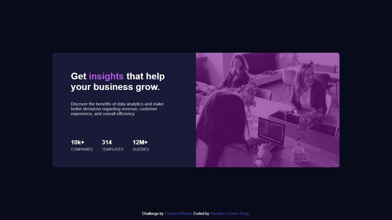

# Frontend Mentor - Stats preview card component solution

This is a solution to the [Stats preview card component challenge on Frontend Mentor](https://www.frontendmentor.io/challenges/stats-preview-card-component-8JqbgoU62). Frontend Mentor challenges help you improve your coding skills by building realistic projects. 

## Table of contents

- [Overview](#overview)
  - [The challenge](#the-challenge)
  - [Screenshot](#screenshot)
  - [Links](#links)
- [My process](#my-process)
  - [Built with](#built-with)
  - [What I learned](#what-i-learned)
  - [Continued development](#continued-development)
  - [Useful resources](#useful-resources)
- [Author](#author)
- [Acknowledgments](#acknowledgments)

## Overview

### The challenge

Users should be able to:

- View the optimal layout depending on their device's screen size

### Screenshot



### Links

- Solution URL: [](https://github.com/chetanhaobijam/Stats_Preview_Card_Component)
- Live Site URL: [](https://chetanhaobijam.github.io/Stats_Preview_Card_Component/)

## My process

### Built with

- Semantic HTML5 markup
- CSS custom properties
- Flexbox
- CSS Grid
- Mobile-first workflow

**Note: These are just examples. Delete this note and replace the list above with your own choices**

### What I learned

While working on this webpage I get to learn so many things that I don't know earlier. 
List of things that I have learn from this project.

1. CSS Custom Properties.
I get to know how to properly apply CSS Custom Properties on my stylesheet. It reduces code repetition and saves a lot of time.
```css
:root {
	--main-background-blue: hsl(233, 47%, 7%);
	--card-background-blue: hsl(244, 38%, 16%);
	--accent-violet: hsl(277, 64%, 61%);
	--main-heading-white: hsl(0, 0%, 100%);
	--main-paragraph-white: hsla(0, 0%, 100%, 0.75);
	--stats-headings-white: hsla(0, 0%, 100%, 0.6);
	--attribution-link: hsl(228, 45%, 44%);
}
```

2. Shading an image.
I get to know how to shade a image with slight transparent purple color in this case. I used absolute position to position the shade div exactly over the image.
```css
#shade {
	position: absolute;
	top: 0;
	left: 0;
	background-color: #7a0f8c;
	opacity: 0.6;
	width: 100%;
	height: 100%;
}
```

3. Giving rounded corners to an image.
While I was doing this project, I kept thinking how to give rounded corners to an image. I gave rounded corners to the main card but since the image covers its entire section I found it hard to give rounded corners to the image. And I didn't want to give rounded corners to the whole image, only some corners. After searching I found that I can do that by giving rounded corners to each corner of the image that I want.
```css
#image picture img{
	border-top-left-radius: 10px;
	border-top-right-radius: 10px;
}
```

4. Giving max-width to an image or card.
I had lot of problem dealing with the size of the image and the card since they expand so much when I increase the screen-size. After searching I found that I can limit them by applying max-width property.
```css
#card {
	margin: 2rem auto;
	max-width: 500px;
}
```

### Continued development

I want to know more about CSS Custom Properties, how to control the width and height of an element, how to make a website more responsive.

### Useful resources

- [Using CSS custom properties (variables) MDN Docs](https://developer.mozilla.org/en-US/docs/Web/CSS/Using_CSS_custom_properties) - The article given there about CSS Custom Properties really help me learn about it.
- [CSS Max-width property](https://www.w3schools.com/cssref/pr_dim_max-width.asp) - Amazing article about CSS Max-width property. 
- [CSS Border-radius property](https://www.w3schools.com/cssref/css3_pr_border-radius.asp) - This article let understand more about border-radius property.

## Author

- Frontend Mentor - [@chetanhaobijam](https://www.frontendmentor.io/profile/chetanhaobijam)
- Twitter - [@chetanhaobijam](https://www.twitter.com/chetanhaobijam)

## Acknowledgments

Thanks to Matt and his team for creating such a great website where we can do coding challenges and test our frontend skills. Looking forward for next challenge.
